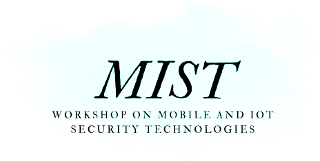

{:style="text-align:center;"}
{:class="img-responsive" style="width: 80%; display:block; margin-right:auto; margin-left:auto;}

<!--{: style="text-align: center"}
# MIST at [ESORICS 2025]

{: style="text-align: center"}
### Mobile and IoT Security Technologies
-->

{: style="text-align: center"}
The MIST Workshop will be co-located with the\
 [30th European Symposium on Research in Computer Security(ESORICS) 2025](https://esorics2025.sciencesconf.org/){:target="_blank"}

{: style="text-align: center"}
**September 22-26, 2025 - Toulouse, France**

{: style="text-align: justify"}
The rapid growth of IoT devices and mobile technologies has transformed modern computing, presenting both new opportunities and critical security challenges. IoT systems, widely used in smart homes, industry, healthcare, and critical infrastructure, are vulnerable to cyberattacks due to insecure communication protocols, firmware weaknesses, and misconfigurations. At the same time, mobile devices, essential for personal and enterprise security, handle sensitive data, authentication, and financial transactions, making their protection a top priority.

{: style="text-align: justify"}
The MIST workshop will explore the latest advancements in IoT and mobile security, focusing on the specific vulnerabilities these systems face. Additionally, it will examine the impact of generative AI (genAI) and Large Language Models (LLMs) on this field. These technologies can enhance security by automating threat detection and response strategies but also pose new risks, as attackers may use them to bypass defenses and exploit IoT and mobile system vulnerabilities.
