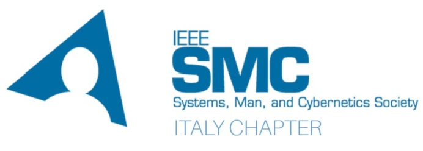

<!--  -->

### Institutional Sponsors 
- <a href="https://dimeg.unical.it/">Department of Mechanical, Energy and Management Engineering (DIMEG)</a>
- <a href="https://dimes.unical.it/">Department of Computer Engineering, Modeling, Electronics and Systems (DIMES)</a>

### Technical Sponsors
- <a href="https://serics.eu/">Project SERICS (PE00000014) under the MUR National Recovery and Resilience Plan funded by the European Union - NextGenerationEU</a>
- <a href="https://r8.ieee.org/italy-smc/">IEEE SMC Italy Chapter</a>
- <a href="https://mlsysops.eu">MLSysOps</a>

